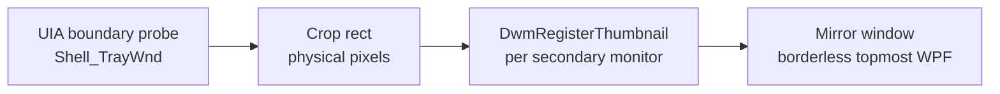
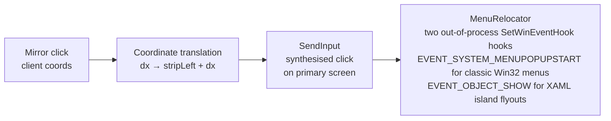

<div align="center">

  # traymirror

  **Mirrors the Windows 11 system tray onto every secondary monitor, live, with no polling and nothing injected into Explorer.**

  [](LICENSE)
  [](https://github.com/latticelabs-au/traymirror/releases)
  [](#%EF%B8%8F-requirements)
  [](#-build-from-source)

  [Quick start](#-quick-start) · [How it works](#-how-it-works) · [Releases](../../releases)
</div>

## What it does

Windows 11's "show taskbar on all displays" feature adds a secondary taskbar to each connected monitor. That bar includes the Start button, task buttons, the clock, and the notification centre. What it does not include is the notification area: the icon strip to the left of the clock on the primary bar that holds volume, network, OneDrive, and any tray-resident app. Those icons simply do not appear on secondary displays.

traymirror fills exactly that gap. It places a borderless, topmost window on each secondary monitor, anchored to the right side of that monitor's taskbar beside the clock, and renders a live copy of the primary tray strip inside it. The copy is pixel-perfect and GPU-composited. There is no polling, no screenshot loop, and no icon-by-icon rendering.

<!-- Screenshot: add a still or GIF here showing the mirrored strip beside the secondary clock. -->

---

## ✨ Features

- **Live GPU-composited thumbnail.** The mirrored strip updates in real time as tray icons change, animate, or show badge indicators. No polling interval, no visible lag.
- **Per-monitor DPI aware.** The source crop rectangle is computed in physical pixels; the host window declares per-monitor DPI v2 awareness so Windows scales the thumbnail correctly to each display.
- **Zero CPU at rest.** DWM composites the thumbnail on the GPU. The app's CPU usage when idle is negligible.
- **Click routing.** Left-clicking and right-clicking a mirrored icon translates input to the matching position on the primary taskbar, so the icon responds as it does on the primary. Classic Win32 menus are then moved across to the mirror. See the caveats for what XAML flyouts do.
- **Automatic repositioning.** The mirror window repositions itself when the primary tray boundary changes (icon added, removed, or rescaled) and when monitors are added, removed, or reconfigured.
- **No injection.** Nothing is loaded into `explorer.exe`. The `SetWinEventHook` registrations are out of process, tray boundaries come from UI Automation, and rendering is `DwmRegisterThumbnail`.

---

## 🖥️ Requirements

- **Windows 11** build 22000 (21H2) or later. Tested on build 26100.
- A **second monitor** connected and active.
- The secondary taskbar enabled: Settings > Personalisation > Taskbar > "Show my taskbar on all displays".
- The app must run **at the same integrity level as Explorer** (standard user in the normal Windows 11 configuration).
- The self-contained release build needs no separate .NET runtime. The framework-dependent zip needs the .NET 10 Desktop Runtime installed.
- **win-x64 only.** There is no arm64 build.

---

## 🚀 Quick start

1. Download one of the two win-x64 builds from the [Releases](../../releases) page:
   - `traymirror-<version>-win-x64.exe`: self-contained single file, runs on a clean Windows 11 machine with no .NET runtime installed.
   - `traymirror-<version>-win-x64-framework-dependent.zip`: smaller, but it needs the .NET 10 Desktop Runtime already installed.
2. Download `SHA256SUMS.txt` from the same release and check what you downloaded against it: `Get-FileHash .\traymirror-<version>-win-x64.exe -Algorithm SHA256`. The hashes in the file are lowercase, so compare case insensitively.
3. On first run, Windows SmartScreen will warn that the binary is unsigned, because it is. Click **More info** then **Run anyway**. See [Caveats and known limits](#%EF%B8%8F-caveats-and-known-limits).
4. traymirror starts minimised to the system tray. A mirror strip appears beside the clock on each secondary monitor within a few seconds.
5. To configure, right-click the traymirror tray icon and choose **Open config file**. The config file lives at `%APPDATA%\TrayMirror\traymirror.jsonc` and is created with defaults on first run.
6. To stop traymirror starting with Windows, right-click the tray icon and uncheck **Start with Windows**.

---

## ⚙️ Configuration

traymirror reads `%APPDATA%\TrayMirror\traymirror.jsonc` on startup and whenever the file changes on disk. A file with defaults is created automatically on first run. Most settings take effect immediately on save; restart the app if a change is not picked up.

| Key | Type | Default | Why it is there |
|-----|------|---------|-----------------|
| `startWithWindows` | `bool` | `true` | Writes or removes a `HKCU\Software\Microsoft\Windows\CurrentVersion\Run` entry. Keeping this in the config file rather than in a UI-only checkbox means you can manage autostart through a Group Policy or a startup-folder script on managed machines without traymirror fighting you. |
| `monitors` | `string[]` | `[]` (all) | Restricts mirroring to specific monitors by their DeviceName, for example `["\\\\.\\DISPLAY1"]` where `\\.\DISPLAY1` is a secondary monitor. Useful when one secondary monitor already has its own tray utility and you only want traymirror on the others. An empty array mirrors to all secondary monitors. |
| `opacity` | `float` | `1.0` | Sets the DWM thumbnail window opacity from 0.0 to 1.0. Reduce slightly if the mirrored strip looks visually disconnected from the secondary taskbar under a high-contrast or custom theme. |
| `stripPaddingRight` | `int` | `0` | Additional pixels of right-hand margin between the mirror window and the secondary clock. Use this if the UIA-detected clock boundary leaves a gap or overlap on non-standard taskbar sizes or third-party shell extensions. |
| `diagnosticsLog` | `bool` | `false` | Writes a diagnostic log to `%TEMP%\traymirror.log`. Captures UIA boundary readings, DWM handle registration events, and click-translation offsets. Enable this before filing a bug report. |

<details>
<summary>Per-monitor overrides</summary>

You can override `opacity` and `stripPaddingRight` for a specific monitor by adding a `perMonitor` block keyed on that secondary monitor's DeviceName:

```jsonc
{
  "opacity": 1.0,
  "stripPaddingRight": 0,
  "monitors": [],
  "perMonitor": {
    "\\\\.\\DISPLAY1": {
      "opacity": 0.92,
      "stripPaddingRight": 2
    }
  }
}
```

`perMonitor` entries are merged on top of the top-level defaults, so you only need to list the keys you want to override for that monitor.

</details>

---

## 🧠 How it works

Windows provides `DwmRegisterThumbnail` and `DwmUpdateThumbnailProperties` precisely for rendering a live, GPU-composited, source-cropped copy of one window's client area into another window. The compositing happens entirely in the Desktop Window Manager's render thread. The app never reads or writes a pixel buffer.

**Why DWM thumbnails and not icon scraping**

An alternative approach would be to walk the `Shell_TrayWnd` child hierarchy or the `NotifyIconData` structures and render each icon individually: read the `HICON` handle for each tray slot, draw it to a bitmap, and composite the bitmaps side by side. That approach has several compounding problems:

- Icon handles are owned by the originating process. Copying them reliably across process boundaries requires either a shared-memory protocol or undocumented Shell internals that change between Windows builds.
- Many modern tray icons are animated or carry badge overlays that live beyond the static `HICON`. A snapshot misses those.
- The strip must be redrawn on every icon change, which means polling or attaching a global shell hook.
- Each icon requires its own rendering, hit-testing, and DPI-scaling logic.

The DWM thumbnail approach costs none of that. traymirror passes the primary taskbar's tray window as the thumbnail source. DWM captures it at native resolution, scales it to the destination rectangle on the GPU, and delivers the result to the secondary monitor's compositor. The output is pixel-perfect by construction: whatever the user sees on the primary tray (including animations, badge counts, and theme transitions) appears identically in the mirror. The app's CPU involvement after the initial `DwmRegisterThumbnail` call is zero.

**What the DWM approach costs**

DWM thumbnails are a visual surface only. Clicks on the mirror window do not pass through to the source window automatically. To make tray icons interactive, traymirror translates each click at mirror-local offset `dx` to a primary-screen x coordinate (`stripLeft + dx`) and synthesises the corresponding mouse event there using `SendInput`. This translation has consequences worth understanding before you rely on the app:

- The cursor briefly moves to the primary screen on every synthesised click. For left-clicks this warp is instantaneous and barely perceptible. For right-clicks it is more visible, because the menu opens on the primary first and is only then moved across.
- The translation must account for per-monitor DPI differences between the primary and secondary displays, because the synthesised event is expressed in primary-screen physical pixels.
- The app must hold a UIPI-compatible integrity level (the same level as Explorer) to deliver synthesised input to Explorer's tray process.

UI Automation is used for one narrow task only: locating the two crop boundaries on the primary taskbar, the left edge of the first notification-area element and the left edge of the clock. Those two points define the source crop rectangle passed to `DwmUpdateThumbnailProperties`. UIA is not used for hit-testing and not used for rendering. Hit-testing is plain arithmetic in `TrayMirror.Core`: a click at mirror-local `dx` maps to primary-screen x of `stripLeft + dx`.

The boundaries are re-read, and the crop rectangle recomputed, on the registered `TaskbarCreated` message (Explorer restart), on `WM_DISPLAYCHANGE`, and on `WM_DPICHANGED`.

Menu relocation registers two out-of-process `SetWinEventHook` hooks, and both are needed. `EVENT_SYSTEM_MENUPOPUPSTART` catches classic Win32 `#32768` tray menus. `EVENT_OBJECT_SHOW` catches XAML island flyouts, because the quick-settings panels never raise the menu event. Neither hook requires injection, because both are registered out of process.

---

## 🖱️ Controls and tray behaviour

| Action | Result |
|--------|--------|
| Left-click a mirrored icon | Translates to a left-click at the matching position on the primary tray. The icon's normal response (toggle flyout, open the app window) fires on the primary. |
| Right-click a mirrored icon | Translates to a right-click on the primary. A classic Win32 menu is then relocated beside the mirrored icon. A XAML quick-settings flyout usually stays on the primary. The cursor moves to the primary monitor to deliver the click. |
| Hover over the mirror strip | Hover events are not synthesised. Tooltips do not appear on the secondary monitor. |
| Right-click the traymirror tray icon | Opens the traymirror context menu: Reload config, Start with Windows (a checkable toggle), Open config file, Open diagnostics log, Exit. |
| Monitor connected or disconnected | traymirror handles `WM_DISPLAYCHANGE` and rebuilds mirror windows for the new monitor layout. |
| Primary tray changes (icon added or removed) | traymirror re-reads the UIA boundaries and updates the DWM source crop rectangle. The mirror resizes to match. |
| Explorer restarts | The registered `TaskbarCreated` message fires. Every thumbnail handle is unregistered and the mirrors are rebuilt against the new `Shell_TrayWnd`. |

---

## 🏗️ Architecture

**Visual path**



**Input path**



**Project layout (planned, not yet on disk)**

This first commit is documentation and configuration only. The three projects below are the shape the code takes when it lands, not files you can build today.

```
traymirror.sln
src/
  TrayMirror/             WPF shell: App.xaml, mirror windows, tray icon, Win32 and DWM P/Invoke
  TrayMirror.Core/        Monitor topology, DPI maths, tray model, config parsing, placement logic
tests/
  TrayMirror.Core.Tests/  xUnit tests targeting Core only; no WPF dependency
```

`TrayMirror.Core` carries no WPF dependency, so it stays unit-testable without a dispatcher or a real display. The WPF project references Core and owns everything that touches a window handle, a DWM call, or the UI thread.

<details>
<summary>Key Win32 surface used</summary>

| API | Purpose |
|-----|---------|
| `DwmRegisterThumbnail` | Registers a thumbnail relationship between the primary taskbar window and a mirror window |
| `DwmUpdateThumbnailProperties` | Sets the source crop rect (tray strip bounds in physical pixels), destination rect, and opacity |
| `DwmUnregisterThumbnail` | Releases the thumbnail relationship on monitor disconnect or app exit |
| `SendInput` | Synthesises mouse events on the primary screen for click and right-click routing |
| `SetWinEventHook` | Two out-of-process registrations for menu relocation: `EVENT_SYSTEM_MENUPOPUPSTART` for classic Win32 `#32768` tray menus, and `EVENT_OBJECT_SHOW` for XAML island flyouts |
| UI Automation (`IUIAutomation`) | Locates the two crop boundaries on the primary taskbar (first notification-area element, clock) to compute the DWM source crop rect. Not used for hit-testing or rendering |
| `SetWindowPos` | Positions mirror windows at the correct location on each secondary taskbar, right-aligned to the clock |

</details>

---

## 🔨 Build from source

**Prerequisites**

- [.NET 10 SDK](https://dotnet.microsoft.com/download/dotnet/10.0) version 10.0.302 or later in the same feature band (the exact pin is in `global.json`; `dotnet --version` must agree)
- Windows 11 build 22000 or later: the WPF target and DWM interop do not build on Linux or macOS
- Visual Studio 2022 v17.12 or later, or JetBrains Rider 2024.3 or later (optional; the `dotnet` CLI is sufficient for building and testing)

**Steps**

The projects have not landed yet, so `dotnet build` has nothing to compile in this commit. These are the commands to use once `traymirror.sln` exists. CI runs the `dotnet restore`, `dotnet build -c Release` and `dotnet test -c Release` steps; `dotnet run` is for local use only.

```powershell
git clone https://github.com/latticelabs-au/traymirror.git
cd traymirror
dotnet restore
dotnet build -c Release
dotnet run --project src/TrayMirror -c Release
```

Warnings are errors. That comes from `TreatWarningsAsErrors` in `Directory.Build.props`, not from a flag on the command line, so a plain `dotnet build -c Release` already enforces it.

Run the tests:

```powershell
dotnet test -c Release
```

Produce the self-contained single-file binary, which is the build the release workflow ships as `traymirror-<version>-win-x64.exe`:

```powershell
dotnet publish src/TrayMirror/TrayMirror.csproj -c Release -r win-x64 `
  --self-contained true `
  -p:PublishSingleFile=true
```

The output lands in `src/TrayMirror/bin/Release/net10.0-windows10.0.22621.0/win-x64/publish/`.

<details>
<summary>Framework-dependent build</summary>

The release workflow also publishes a framework-dependent build and ships it as `traymirror-<version>-win-x64-framework-dependent.zip`. It is much smaller, and it needs the .NET 10 Desktop Runtime installed on the target machine:

```powershell
dotnet publish src/TrayMirror/TrayMirror.csproj -c Release -r win-x64 `
  --self-contained false `
  -p:PublishSingleFile=false
```

win-x64 is the only runtime identifier this project builds. There is no arm64 build.

</details>

<details>
<summary>Verifying your build environment</summary>

The `global.json` at the repo root pins the SDK to `10.0.302` with `rollForward: latestFeature`. If `dotnet restore` fails with an SDK version error, check `dotnet --version` and install the correct SDK band from the link above. Do not override `global.json` locally; if you need a different SDK version for another project, use `.NET SDK installation locations` in Visual Studio or a separate shell profile.

</details>

---

## ⚠️ Caveats and known limits

**The cursor warps to the primary monitor on click.** A DWM thumbnail is a visual surface only, so it does not hit test. To make a mirrored icon respond, traymirror moves the cursor to the matching point on the primary taskbar and synthesises the click there. There is no way to route input to a tray icon without doing that. Left-clicks are fast enough that the warp is barely perceptible; right-clicks hold the cursor on the primary for longer, because the menu opens there before it is relocated.

**XAML quick-settings flyouts may stay on the primary monitor.** The Volume, Network, and Notification Centre flyouts in Windows 11 are XAML islands rather than classic menus. `MenuRelocator` sees them through the `EVENT_OBJECT_SHOW` hook and tries to move them with `SetWindowPos`. Classic `#32768` menus (most third-party tray apps) relocate reliably. Whether the XAML-hosted flyouts can be relocated the same way is an open question that has not been settled yet, so expect some of them to stay on the primary.

**Per-monitor DPI differences soften the mirrored strip.** If the primary monitor runs at 150% scaling and a secondary runs at 100%, DWM must downscale the thumbnail. The result is softer than native icons rendered at 100% and the degree of softening depends on the scaling ratio and the GPU's scaling filter. This is a fundamental cost of the DWM thumbnail approach: it trades icon-rendering brittleness for compositing fidelity, and the fidelity degrades when display scaling ratios diverge significantly.

**The app must run at the same elevation as Explorer.** `SendInput` cannot deliver events to a process running at a higher Windows integrity level than the sender. In the standard Windows 11 configuration Explorer runs at medium integrity (normal user), and traymirror should too. Running traymirror elevated when Explorer is not is harmless for the visual mirror, but synthesised clicks will not reach UAC-elevated tray processes. The inverse (elevated Explorer, non-elevated traymirror) means synthesised input is silently dropped.

**Behaviour over RDP and fast user switching is untested.** DWM thumbnail relationships are tied to the current desktop session. A Remote Desktop connection, a fast user switch, or a lock-and-unlock cycle may invalidate the registered thumbnail handles. Recovery from a session change is on the manual verification checklist and has not been verified yet, so do not rely on traymirror in remote-desktop environments.

**The binaries are unsigned, and the only check available is a hash.** There is no Authenticode code-signing certificate for this project, so Windows SmartScreen shows a "Windows protected your PC" warning on first run and the publisher reads as unknown. That is expected, not a fault. What you can do is confirm the file you downloaded is the file the release workflow built. Download `SHA256SUMS.txt` from the same release and compare:

```powershell
Get-FileHash .\traymirror-1.0.0-win-x64.exe -Algorithm SHA256
```

Replace `1.0.0` with the version you downloaded, then match the result against the line for that filename in `SHA256SUMS.txt`. The hashes there are lowercase, so compare case insensitively. If the hash matches, choose **More info** and then **Run anyway**.

---

## 🤝 Contributing

Read [CONTRIBUTING.md](CONTRIBUTING.md) before opening a pull request. The short version:

- **Format:** `dotnet format --verify-no-changes --severity error` must exit 0. The CI `format` job runs exactly that. Run a bare `dotnet format` locally to fix what it finds.
- **Build:** `dotnet build -c Release` must be clean. Warnings are errors because `Directory.Build.props` sets `TreatWarningsAsErrors`, so there is no flag to add on the command line.
- **Tests:** `dotnet test -c Release` must pass. There is no coverage gate.
- **Commits:** Conventional Commits with lowercase type and lowercase summary, 72-character subject-line cap, no trailing period.
- **Em dash policy:** U+2014 is banned in every tracked file as a house rule. If a sentence seems to need one, restructure it with a colon, a comma pair, parentheses, or two sentences.
- **Em dash enforcement:** the CI `prose` job greps for U+2014 in `'*.md'` and `'docs/**'` only. Source code, resource files, and commit messages are reviewer-enforced, not CI-enforced. The en dash U+2013 is not checked by CI at all; avoid it in prose regardless.
- **Australian spelling** in all prose (behaviour, colour, initialise, centre). Code identifiers and .NET API names stay US-spelled.

All three CI jobs (`build`, `format`, `prose`) run on `windows-latest`. The prose gate is pure text and would run cheaper on Linux, but keeping one runner means you debug one environment instead of two.

Bug reports: use the [bug report template](.github/ISSUE_TEMPLATE/bug_report.yml). Include your `winver` output, monitor count and scaling percentages, and the traymirror diagnostics log. To produce the log, set `"diagnosticsLog": true` in `%APPDATA%\TrayMirror\traymirror.jsonc`, reproduce the issue, then attach `%TEMP%\traymirror.log`.

---

## 📄 License

[MIT](LICENSE). Copyright (c) 2026 Lattice Labs.

---

<div align="center">
  🐨 Built with care in Australia · <a href="https://latticelabs.au">latticelabs.au</a> · <a href="mailto:hello@latticelabs.au">hello@latticelabs.au</a> · © 2026 Lattice Labs
</div>
